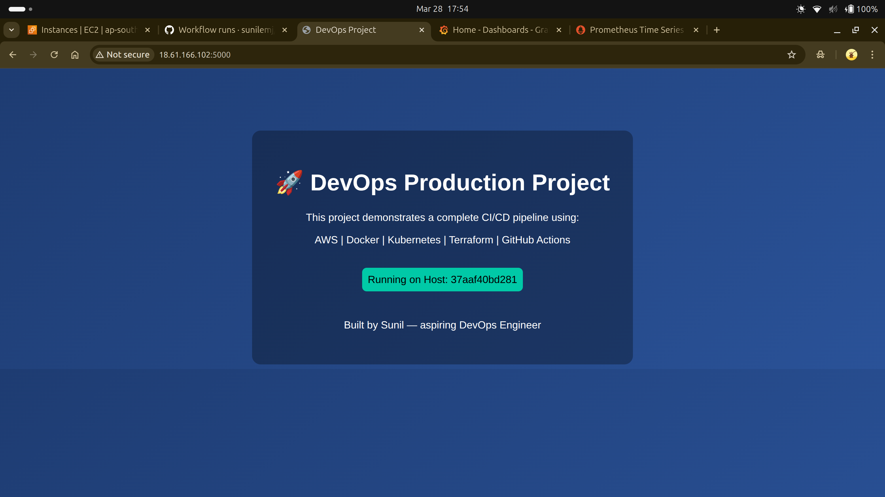
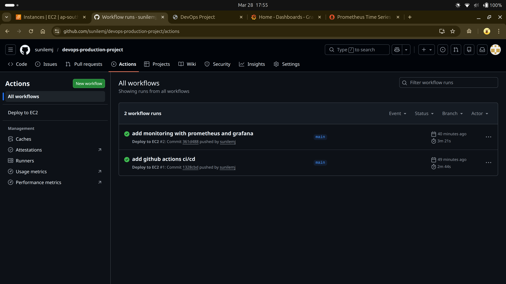
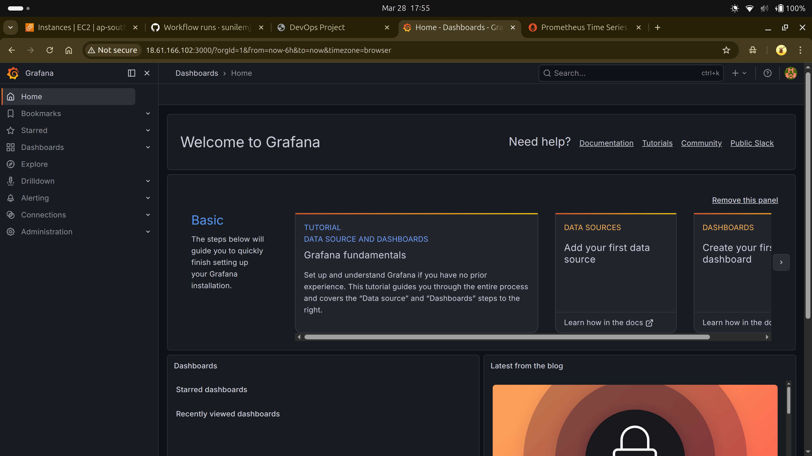
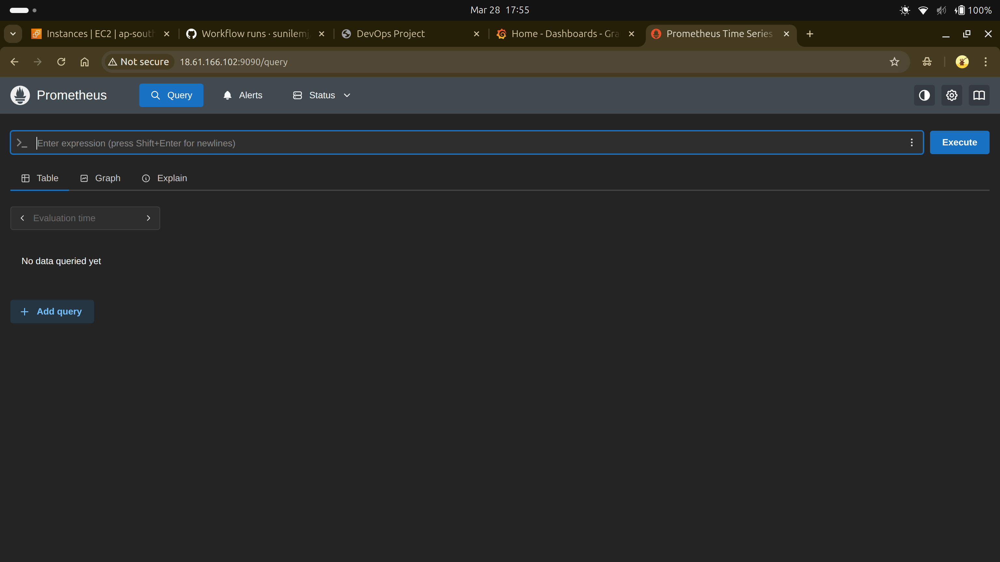

# DevOps End-to-End Project

## What this project does

This project shows how I built a complete DevOps pipeline from scratch using AWS and common industry tools. The goal was to automate everything — from infrastructure creation to application deployment and monitoring.

---

## Tools used

- Terraform → create infrastructure (EC2, security groups, ECR)
- Ansible → configure server and deploy application
- Docker → package application
- AWS ECR → store Docker images
- GitHub Actions → automate deployment (CI/CD)
- Prometheus & Grafana → monitoring

---

## How it works

1. Infrastructure is created using Terraform  
2. Ansible configures the EC2 instance  
3. Application code is pulled from GitHub  
4. Docker image is built and pushed to ECR  
5. Container runs on EC2  
6. GitHub Actions automates this process on every push  
7. Monitoring is available via Grafana and Prometheus  

---

## Screenshots (Proof)

Application running on EC2  

CI/CD pipeline  

Grafana monitoring  

Prometheus metrics  

---

## Important note

The infrastructure was destroyed after testing to avoid unnecessary AWS costs. Screenshots are included as proof of working deployment.

---

## What I learned

- How to automate infrastructure using Terraform  
- How to use Ansible for real deployments  
- Docker image lifecycle (build → push → run)  
- Setting up CI/CD using GitHub Actions  
- Debugging real issues (SSH, Docker, dependencies, Terraform state)  
- Basics of monitoring using Prometheus and Grafana  

---

## Next improvements

- Move to Kubernetes (EKS) for scaling  
- Add load balancer  
- Improve monitoring dashboards  

